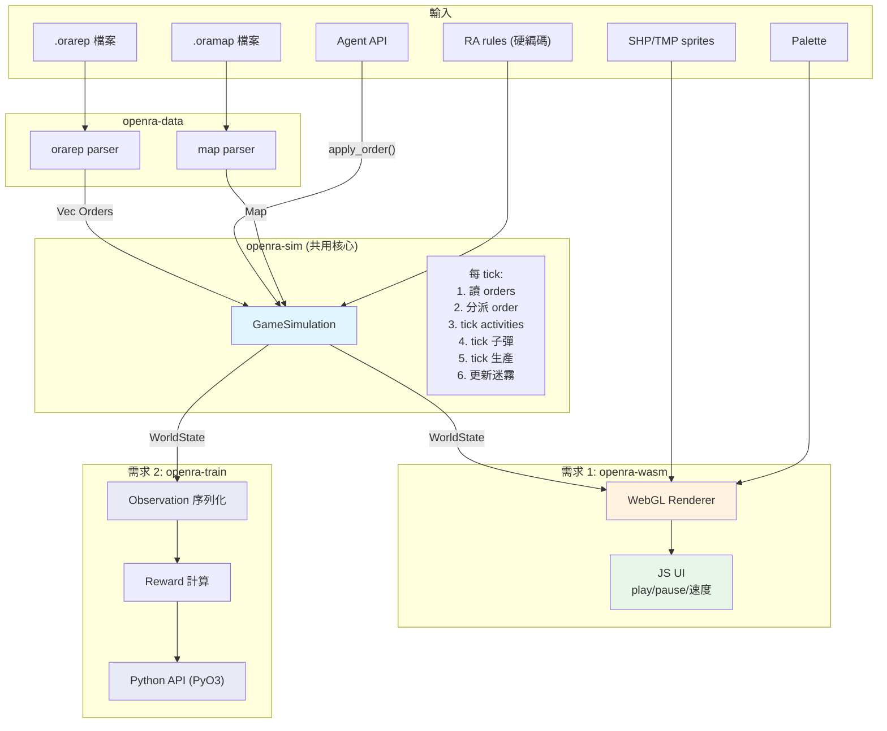
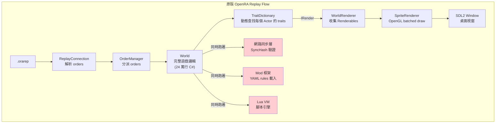
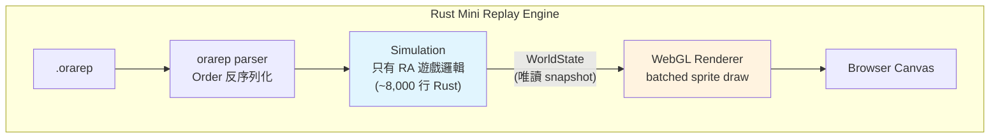
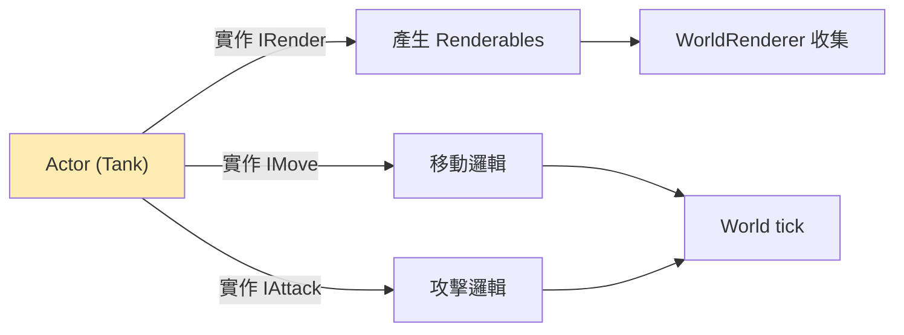
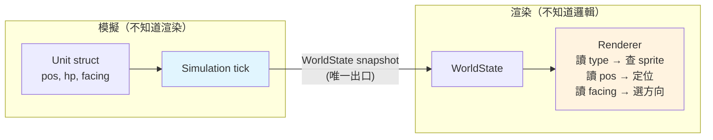
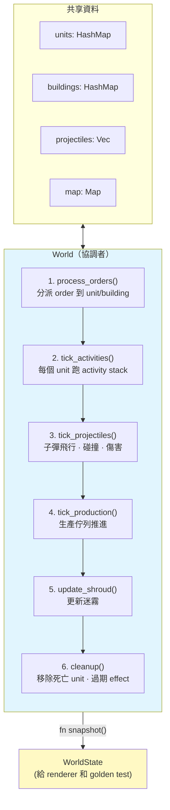

# OpenRA Rust Engine — 技術方案

## 兩個需求，一個引擎

本專案要用 **一個 Rust 遊戲模擬引擎** 同時滿足兩個需求：

| # | 需求 | 場景 | 現有痛點 |
|---|------|------|---------|
| 1 | **Browser Replay Viewer** | 用戶打完一場後在網頁上看回放 | .orarep 無法在官方 OpenRA 播放；Docker + VNC 太重 |
| 2 | **穩定高效的 Training Runtime** | GPU cluster 上 128 agent 並行訓練 | C# JIT crash、gRPC 斷線、每場一個 Docker 容器太貴 |

兩個需求共享同一個模擬核心（`openra-sim` crate），只有 I/O 層不同：

```
需求 1 (Replay):   .orarep file → openra-sim → WebGL (瀏覽器)
需求 2 (Training): Agent API    → openra-sim → Observation JSON (Python)
```

---

## 為什麼需要做這個

### 需求 1：Browser Replay

1. 現有 `.orarep` 無法在官方 OpenRA 播放（版本 `{DEV_VERSION}` + `BotType: rl-agent` 不相容）
2. 現有 `openra-rl replay` 需要 Docker + VNC，太重
3. 網頁上的 replay viewer 是 demo/marketing 的關鍵功能
4. 嵌入 openra-rl.dev 網站，訪客能直接看 AI 對戰回放

### 需求 2：Training Runtime

現有 C# engine 在 GPU cluster 上跑 128 agent 訓練時有三個根本問題：

**問題 1：JIT 造成 crash**

.NET JIT 是 lazy 的 — 方法第一次呼叫時才編譯。128 個 .NET process 同時啟動：

```
128 個 JIT compiler 同時搶 CPU + 記憶體
→ 記憶體尖峰 → OOM kill → server crash

遊戲前幾 tick:
  第一次呼叫 Mobile.Tick()   → JIT 暫停 50-200ms
  第一次呼叫 PathFinder()    → JIT 暫停 50-200ms
  累積暫停 → OpenRA 內部 TCP 連線 timeout
  → world.IsConnectionAlive = false → Game.Exit()
```

加上 .NET tiered compilation（Tier 0 快速編譯 → Tier 1 背景重新優化），128 個 process × 2 輪 JIT + GC 線程搶 CPU = 不可預測的 frame spike。

單個跑正常，128 個一起就垮。問題不可重現、不可預測。

**問題 2：Bridge Client (gRPC) 脆弱**

每場遊戲的通訊鏈：

```
Python Agent
    ↕ HTTP/WebSocket (:8000)
FastAPI Server
    ↕ gRPC (:9999)              ← bridge client
C# ExternalBotBridge
    ↕ TCP (internal)             ← OpenRA 內部 client-server
C# 遊戲模擬
```

128 場 = 128 條通訊鏈，每層都是問題點：

| 層 | 問題 | 128 場放大效應 |
|----|------|---------------|
| gRPC | 每 tick 觀測要 Protobuf 序列化/反序列化 | 每秒數千次 ser/deser |
| gRPC | 每場需要獨立 port (9999-10126) | 128 port 管理，任一失敗 = 一場作廢 |
| gRPC | 斷線 → `OnAgentDisconnected()` → `Game.Exit()` | 網路抖動/GC pause 都可能觸發 |
| TCP (內部) | JIT pause → timeout → `IsConnectionAlive = false` | 128× crash 機率 |
| Docker | 每場一個容器 | 128 容器啟動/排程/記憶體 |

**問題 3：資源消耗**

```
128 agents = 128 Docker containers
每個容器:
  .NET runtime        ~150 MB RAM
  OpenRA C# engine    ~100 MB RAM
  FastAPI + Python     ~80 MB RAM
  gRPC bridge          ~20 MB RAM
  ─────────────────────────────────
  合計                 ~350 MB × 128 = ~44 GB RAM
  + 128 個 OS processes, 128 個 GC
```

---

## .orarep 格式

`.orarep` 是 **command-based replay**，不是錄影：

```
[Frame N]
├── ClientID (int32)
├── PacketLength (int32)
└── PacketData
    ├── Frame number (int32)
    └── Orders: Move(unit_42, cell_50_30), Attack(unit_42, unit_100), ...

[Metadata at EOF]（YAML）
├── Mod: ra
├── Version: {DEV_VERSION}
├── MapUid, MapTitle
├── FinalGameTick
├── Players（name, faction, color, outcome）
```

**重播原理**：讀 order → 餵給 engine → engine 重跑完整遊戲邏輯 → 渲染。
要求 engine 的行為跟錄製時 **bit-for-bit 一致**（確定性），否則 desync。

---

## 方案選擇

### 已排除的方案

| 方案 | 排除原因 |
|------|---------|
| **Rust 重寫整個 OpenRA engine** | 24 萬行，年級工程 |
| **C# .NET WASM (Blazor)** | Bundle ~100-200 MB（AOT runtime ~35-60 MB + native deps ~2-5 MB + assets ~40-120 MB），首次載入 30-60 秒，Mono runtime bug 難控制 |
| **Server-side VNC 串流** | 需要 server 跑 engine，不是純 client-side |
| **State-based replay (錄狀態不錄指令)** | 缺射擊/爆炸事件，視覺保真度 ~95%，不是 100% |

### 選定方案：Rust mini replay engine → WASM

**只實作 replay 跑得通的最小遊戲邏輯**，不重寫整個 OpenRA。

核心思路：
- 讀 `.orarep` 的 orders
- 用 Rust 重跑遊戲邏輯（只有 RA mod、只有 replay 需要的子集）
- 用 WebGL 渲染
- 編譯成 WASM，瀏覽器直接跑

---

## 為什麼選 Rust 而不是 C# WASM

| | Rust WASM | C# WASM |
|--|-----------|---------|
| Bundle 大小 | ~12-13 MB（engine ~2-3 MB + sprites ~10 MB） | ~100-200 MB gzip（.NET AOT ~35-60 MB + native deps ~2-5 MB + assets ~40-120 MB） |
| Runtime 依賴 | 無 | .NET Mono runtime |
| WASM 支援 | 一等公民（wasm-pack） | 實驗性（Blazor） |
| 效能 | Native 速度 | 比 native 慢 2-3x |
| Agent 自主 debug | ✅ cargo test 驅動 | ❌ Mono bug 要人工介入 |
| 確定性風險 | 有，但可用 golden test 自動化解決 | 零（同一份 code） |

---

## Mini Replay Engine vs 完整 Engine

我們做的**不是重寫 OpenRA**。是寫一個只能播放 `.orarep` 的最小引擎。

```
OpenRA 完整功能                    我們要做嗎？
────────────────────               ──────────
移動 / 攻擊 / 建造 / 採礦          ✅ 要（遊戲邏輯）
Pathfinding / Fog of war          ✅ 要（遊戲邏輯）
傷害計算 / 武器 / 裝甲             ✅ 要（遊戲邏輯）
生產佇列 / 電力系統                ✅ 要（遊戲邏輯）
────────────────────               ──────────
Trait 動態組裝框架                 ❌（用 struct 取代）
YAML rules 解析器                 ❌（硬編碼 RA 數值）
網路同步 / lockstep               ❌（replay 是單機的）
遊戲 UI / 選單                    ❌（用 HTML/CSS）
地圖編輯器                        ❌
Lua VM                           ❌
音效引擎                          ❌（之後再加）
TD / D2k mod                     ❌（只做 RA）
存檔 / 讀檔                       ❌
────────────────────               ──────────
程式碼量                           ~8,000-10,000 行 vs 150,000-200,000 行
時間                              ~2 週 vs ~1-2 年
```

**上半部分（遊戲邏輯）全部要寫，而且必須跟 C# bit-for-bit 一致。**
**下半部分（框架和周邊）全部不寫。**

這就是為什麼只佔 OpenRA 的 ~4%。

---

## 架構設計

### 核心原則

1. **模擬和渲染完全分離** — 模擬產出 WorldState，渲染只讀 WorldState。兩者不共享可變狀態。
2. **照抄邏輯邊界，不抄框架** — Rust 模組名對應 C# 檔名，方便 desync debug。但不搬 trait 系統。
3. **每一層能獨立測試** — Layer 1 不需要 Layer 2 就能跑 test。Layer 2 不需要渲染就能跑 golden test。

### 為什麼模擬和渲染必須分離

**為了讓 golden test 能在沒有渲染的情況下跑。**

我們的整個 desync debug 策略建立在一個前提上：agent 跑 `cargo test` → 看 fail message → 自己修 → 再跑。這個循環不需要人介入。

如果模擬跟渲染耦合（像 OpenRA 原版），測試時必須把渲染也跑起來 — 需要 WebGL、瀏覽器、sprite 載入。Agent 在 terminal 裡做不到這些，整個自動化 debug 策略就崩潰了。

分離之後，模擬層是純數字計算，`cargo test` 直接比對數字，不碰任何渲染。

附帶的好處：
- **Bug 隔離**：golden test pass 但畫面不對 → 一定是渲染的問題，不用懷疑模擬
- **平行開發**：模擬和渲染可以兩個人同時做
- **渲染可替換**：先用 Canvas 2D 驗證，再換 WebGL，模擬不用改

OpenRA 原版選擇耦合是因為它要服務 modder — 一個 trait 同時定義邏輯和外觀，modder 加一行 YAML 就搞定。我們沒有 modder，不需要這個便利性，解耦換來的可測試性更有價值。

### 統一 Crate 結構

```
openra-sim/          ← 純模擬 crate (no_std compatible，零外部依賴)
├── lib.rs           # GameSimulation::new(), tick(), apply_order()
├── state.rs         # WorldState, Actor, Player
├── rules.rs         # RA 單位/武器數值（硬編碼）
├── math.rs          # WPos, WAngle, 定點數
├── rng.rs           # MersenneTwister (bit-for-bit 複製 C#)
└── systems/         # 移動、攻擊、生產、尋路...

openra-data/         ← 檔案解析 crate
├── orarep.rs        # .orarep 解析
├── oramap.rs        # .oramap 載入
├── shp.rs           # SHP sprite 解碼
└── palette.rs       # Palette 載入

openra-wasm/         ← 需求 1: Browser Replay Viewer
├── lib.rs           # WASM bindings
├── renderer.rs      # WebGL batched sprite renderer
└── ui.rs            # JS interop (play/pause/speed)

openra-train/        ← 需求 2: Training Runtime
├── lib.rs           # 128 GameSimulation instances
├── server.rs        # Python ↔ Rust API (PyO3 或 TCP)
├── obs.rs           # WorldState → Observation 序列化
└── reward.rs        # 8 維 reward vector 計算
```

`openra-sim` 是核心，零依賴，不知道自己被用在 replay 還是 training。

### 資料流（兩個需求）



---

## 原版 Engine Replay vs 我們的計畫

### 原版 OpenRA 怎麼播 replay



紅色部分是 replay 播放時**不需要但仍然在跑**的 overhead。

### 我們的計畫



沒有紅色部分。

### 關鍵差異

| | 原版 OpenRA | 我們的 Rust engine |
|--|------------|-------------------|
| **模擬跟渲染的關係** | 緊耦合 — 每個 Actor 透過 IRender trait 自己產生 Renderable | 完全分離 — 模擬輸出 WorldState，渲染只讀它 |
| **誰決定畫什麼** | Actor 自己（IRender trait） | Renderer 根據 WorldState 裡的 type + pos 決定 |
| **框架 overhead** | TraitDictionary 動態查找、YAML 解析、Mod 框架 | 無框架，struct + enum 直接寫 |
| **平台依賴** | SDL2 + OpenGL + OpenAL | WebGL + Browser API |
| **支援範圍** | 遊戲 + 多人 + 編輯器 + 3 個 mod | 只播 RA replay |
| **程式碼量** | ~240,000 行 | ~8,000-10,000 行 |
| **渲染方式** | 每個 Actor 每 tick 產生 Renderable list → 排序 → 畫 | Renderer 直接讀 WorldState 的 unit list → 查 sprite → 畫 |
| **確定性** | 保證（同一份 code） | 透過 golden test 保證 |

### 最大的架構差異：模擬-渲染解耦

原版 OpenRA：



Actor **同時知道遊戲邏輯和渲染**。改移動邏輯可能影響渲染，改渲染也可能影響邏輯。

我們的設計：



模擬和渲染之間**只有一根線**（WorldState）。這意味著：
- Golden test 只測模擬，不需要渲染跑起來
- 渲染畫錯了不可能導致 desync
- 可以換渲染實作（WebGL / Canvas 2D / terminal）不影響模擬
- 兩個人可以平行開發模擬和渲染

---

### 解耦邊界

系統有 **4 個明確的解耦點**，每個點兩邊互不知道對方的存在：

**邊界 1：檔案格式 ↔ 模擬**

```
解析層輸出的是通用的 Order struct 和 Map struct。
模擬層不知道 .orarep 是二進制格式還是 JSON。
如果以後換 replay 格式，模擬層不用改。
```

**邊界 2：模擬 ↔ 渲染（最重要的解耦）**

```
模擬層每 tick 產出一個 WorldState（唯讀 snapshot）：
  - 所有 unit 的 (id, type, pos, hp, facing, activity_name)
  - 所有 building 的 (id, type, pos, hp, production_state)
  - 所有 projectile 的 (type, pos, target_pos)
  - 所有 effect 的 (type, pos, frame)
  - shroud 狀態

渲染層只讀這個 snapshot，選正確的 sprite 畫出來。

模擬層不知道 sprite 是什麼。
渲染層不知道 pathfinding 是什麼。
```

為什麼這很重要：
- 模擬的 bug（desync）和渲染的 bug（畫面不對）完全隔離
- golden test 只測模擬層，不需要渲染
- 可以先做完模擬（全部 golden test pass），再做渲染
- 渲染可以替換（Canvas 2D / WebGL / 甚至 terminal ASCII）而不影響模擬

**邊界 3：渲染 ↔ Web 整合**

```
渲染層暴露的 API 只有：
  - init(canvas)
  - render_tick(tick_number)
  - set_camera(x, y, zoom)

JS 層不知道 WebGL 細節。
Rust 層不知道 HTML button 或 CSS。
```

**邊界 4：Rules ↔ 模擬**

```
所有單位/武器數值集中在 rules 模組。
模擬層透過 rules.get_unit_def("e1") 查詢，不硬編碼數值。

好處：
  - 如果數值不對（desync），只在 rules 模組裡改
  - 以後要支援 TD mod，只加一套新的 rules，模擬層不改
```

### 分層架構

```mermaid
block-beta
    columns 2
    block:R1["需求 1: Browser Replay"]
        R1A["JS UI · 播放控制 · 嵌入網站"]
        R1B["WebGL Renderer · 動畫 · 特效"]
    end
    block:R2["需求 2: Training Runtime"]
        R2A["Python API (PyO3) · 128 instances"]
        R2B["Observation 序列化 · Reward 計算"]
    end
    block:SIM:2["openra-sim (共用核心)"]
        SIMA["World tick · Activity system · 所有遊戲邏輯"]
        SIMB["輸入: Orders + Map + Rules → 輸出: WorldState"]
        SIMC["cargo test 驅動 golden test，不需要瀏覽器或 Python"]
    end
    block:DATA:2["openra-data (資料解析)"]
        DATAA[".orarep 解析 · .oramap 載入 · SHP sprite · Palette"]
        DATAB["純資料結構，零副作用"]
    end

    R1 --> SIM
    R2 --> SIM
    SIM --> DATA

    style R1 fill:#e8f5e9
    style R2 fill:#e8eaf6
    style SIM fill:#e1f5fe
    style DATA fill:#f3e5f5
```

### 每層能獨立測試什麼

| 層 | 測什麼 | 怎麼測 | 需要什麼 |
|----|--------|--------|---------|
| Layer 1 | 解析對不對、數學對不對 | 單元測試 | 只需要測試檔案 |
| Layer 2 | 模擬跟 C# 是否一致 | Golden snapshot test | Layer 1 + golden data |
| Layer 3 | 畫面對不對 | 截圖比對（手動） | Layer 1 + 2 + 瀏覽器 |
| Layer 4 | 整合能不能跑 | 手動 | 全部 |

**Debug 原則：從底往上。** Layer 1 錯了 Layer 2 不可能對。Layer 2 對了但畫面不對，那問題一定在 Layer 3。

### 模組對應表（Rust ↔ C#）

每個 Rust 模組直接對應一個 C# 檔案。desync 時：看 test fail message → 找 Rust 模組 → 找同名 C# 檔 → 逐行對照。

```
Layer 1 (資料):
  orarep.rs       ↔  ReplayConnection.cs      # .orarep 解析
  order.rs        ↔  Order.cs                  # Order 反序列化
  map.rs          ↔  Map.cs                    # 地圖載入
  rules.rs        ↔  mods/ra/rules/*.yaml      # 單位/武器數值
  math.rs         ↔  WPos.cs / WAngle.cs       # 定點數座標
  rng.rs          ↔  MersenneTwister.cs        # 隨機數

Layer 2 (模擬):
  world.rs        ↔  World.cs                  # tick 推進
  activity.rs     ↔  Activity.cs               # 行為狀態機
  mobile.rs       ↔  Mobile.cs                 # 移動
  pathfinder.rs   ↔  PathFinder.cs             # A*
  armament.rs     ↔  Armament.cs               # 武器
  projectile.rs   ↔  Bullet.cs / Missile.cs    # 子彈
  health.rs       ↔  Health.cs                 # HP
  production.rs   ↔  ProductionQueue.cs        # 生產
  building.rs     ↔  Building.cs               # 建築
  harvester.rs    ↔  Harvester.cs              # 採集
  shroud.rs       ↔  Shroud.cs                 # 迷霧

Layer 3 (渲染):
  shp.rs          ↔  ShpTDLoader.cs            # Sprite 解碼
  palette.rs      ↔  Palette.cs                # 調色盤
  renderer.rs     ↔  SpriteRenderer.cs         # WebGL 繪製
```

### Layer 2 內部：模擬層怎麼組織

模擬層是最複雜的部分。它的內部也需要解耦。

**World 是唯一的協調者。** 各系統（移動、戰鬥、生產）不互相直接呼叫，都透過 World 的資料互動：



**各系統只是函數，不是 object。** 它們讀 World 的資料，修改 World 的資料，自己不持有狀態：

```
mobile::tick(unit, map)              讀 unit.path + map → 修改 unit.pos
armament::check_fire(unit, target)   讀 unit + target → 回傳 Option<Projectile>
pathfinder::find_path(from, to, map) 純函數，讀 map → 回傳 Vec<CPos>
production::tick(building, player)   讀 building.queue → 修改 player.cash
```

為什麼不用 ECS（Entity Component System）：
- Replay engine 的 entity 類型就那幾種（Unit, Building, Projectile），不需要動態組合 component
- 直接用 struct field 比 ECS query 更容易 debug — 一看就知道 unit 的所有狀態
- 對照 C# 時更直覺 — C# 的 Mobile trait 對應 Rust 的 unit.movement 欄位

---

## Activity System — 最複雜的部分

OpenRA 的單位行為不是簡單的「有 target → 走過去」，而是一個 **Activity stack**（狀態機堆疊）。這是整個專案最難正確複製的部分。

### 它怎麼運作

每個單位有一個 activity stack。每 tick，頂部的 activity 執行，它可以：
- 繼續自己（返回 this）
- 結束自己，跑下一個（返回 NextActivity）
- 暫停自己，插入子任務（返回 ChildActivity）
- 被外部 cancel（收到新 order）

### 為什麼難

一個 Harvester 的 activity stack 在遊戲中會經歷：

```
FindResources → Move(到礦) → Harvest(20 ticks) → Move(到精煉廠) → Unload → 循環
```

每個轉換的**時機**（在哪個 tick 切換到下一個 activity）必須跟 C# 一模一樣。差 1 tick = 後面所有行為都歪 = desync。

### 怎麼降低風險

1. **先只實作 Move 和 Attack**，跑一場簡單的 replay（只有打仗），確認這兩個 activity 完全正確
2. **再加 Harvest / Build**，跑有經濟的 replay
3. **每加一個 activity 都跑 golden test**，確保沒有退化

---

## 測試策略

### 三層測試，從底往上

**Layer 1 測試：資料正確性（不需要 golden data）**

驗證 .orarep 解析、座標轉換、RNG、傷害公式這些**有標準答案**的東西。
跑最快，agent 能完全自主。

**Layer 2 測試：確定性 — Golden Snapshot（核心）**

用 C# engine 跑 replay，每 N tick dump 一次 world state 作為「正確答案」。
Rust engine 跑同一場 replay，逐 tick 比對。
Test fail message 要包含：哪個 tick、哪個 unit、哪個欄位、期望值 vs 實際值。
**Agent 能根據這個 message 直接定位 Rust code 裡哪個函數算錯了。**

**Layer 3 測試：視覺（手動）**

截圖看畫面對不對。最後才做，不阻擋前面的工作。

### Golden Snapshot 設計

**密度策略：前密後疏**

```
前 500 ticks:     每 10 ticks（抓初始化 bug，如 MCV 部署、第一個建築）
500-5000 ticks:   每 100 ticks（穩態階段）
5000+ ticks:      每 500 ticks（後期）

一場 10,000 tick replay ≈ 150 個 snapshots ≈ 2-5 MB JSON
```

**每個 snapshot 記什麼：**

```
tick,
所有單位 (id, type, x, y, hp, facing, current_activity),
所有建築 (id, type, x, y, hp, producing, progress),
每個玩家的 (cash, power_provided, power_drained, units_killed),
在場的子彈/特效數量
```

**Agent 自主 debug 循環：**

```
cargo test
→ FAIL: tick 1523, unit 42 (e1), Y expected 5678 got 5679
→ Agent 讀 mobile.rs，對照 C# Mobile.cs
→ 找到 WPos 整數除法 rounding 差異
→ 修好
→ cargo test
→ 下一個 FAIL 或全 PASS
```

### 需要幾場 replay？

```
Replay 1: 最簡單 — 少量步兵互打，只有 Move + Attack
Replay 2: 有經濟 — 建造基地、生產單位、採礦
Replay 3: 完整對局 — AI vs AI 打完一場

從 1 開始做，1 全 pass 再做 2，2 全 pass 再做 3。
```

---

## 潛在問題

### 確定性風險（按嚴重度排序）

| 風險 | 為什麼難 | 怎麼發現 | 怎麼防 |
|------|---------|---------|--------|
| **Activity 轉換時機** | 差 1 tick 就雪崩 | Golden test: unit activity 不符 | 逐行對照 C#，每個 activity 單獨測 |
| **A* tie-breaking** | 兩條等長路徑選哪條？ | Golden test: unit 走了不同路 | 對照 PathFinder.cs 的 cost 比較 |
| **HashMap 遍歷順序** | Rust HashMap 順序隨機，C# Dictionary 按插入序 | Golden test: 多單位行為順序不同 | 用 BTreeMap 或 IndexMap |
| **排序穩定性** | C# Array.Sort 不穩定，Rust .sort() 穩定 | Golden test: Z-order 或 target 選擇不同 | 用 sort_unstable + 相同的 tiebreaker |
| **整數溢位** | C# 靜默 wrap，Rust debug 模式 panic | Rust 直接 panic 會發現 | 用 wrapping_add / wrapping_mul |
| **RNG 序列** | 必須 bit-for-bit 複製 MersenneTwister | Layer 1 單元測試 | 逐行對照實作 |

### 工程風險

| 風險 | 為什麼難 | 怎麼防 |
|------|---------|--------|
| **不知道需要實作哪些 Order/Activity** | 跑 replay 才知道觸發了什麼 | 增量式：碰到不認識的 order → skip + 警告，再補實作 |
| **地圖差異** | 換地圖可能觸發沒實作的地形邏輯 | 先鎖定一張地圖做到底，再泛化 |
| **特殊單位行為** | 間諜、工程師、Tanya 各有特殊邏輯 | 先不做，遇到再補 |
| **Lua 腳本地圖** | 戰役地圖用 Lua 觸發事件 | 只支援 skirmish 地圖，不支援戰役 |
| **C# golden dump 本身的正確性** | dump script 可能漏東西 | dump 後用 C# 自己驗證一次 |

### 最大的未知：scope creep

一場 replay 可能觸發我們沒預料到的遊戲邏輯。應對策略是**降級而不是 crash**：

```
碰到不認識的 Order   → log 警告 + skip（不影響其他 order）
碰到不認識的 Activity → unit 變 idle（不影響其他 unit）
碰到不支援的地圖功能  → 忽略（可能畫面不對但不 crash）
```

先讓整場 replay 能跑完，再回頭補缺失的功能。

---

## 開發計畫

### Phase 1：基礎設施（1-2 天）

目標：能跑第一個 golden test

- 寫 C# golden dump script，跑 1 場簡單 replay 產出 snapshots
- 建立 Rust workspace（openra-sim, openra-data, openra-wasm, openra-train 四個 crate）
- 實作 openra-data：.orarep 解析、Order 反序列化
- 實作 openra-sim 基礎：WPos/WAngle 數學、RNG、rules 數值
- 第一批單元測試 pass

### Phase 2：核心模擬（3-5 天，agent 主導）

目標：golden test 全場 pass — **此時需求 1 和需求 2 的共用核心完成**

- Move activity + Mobile（單位移動）
- Pathfinding A*
- Attack activity + Armament + Projectile + Health（戰鬥）
- 跑 Replay 1（步兵互打）→ golden test pass
- Production + Building + Power（建造經濟）
- Harvester（資源採集循環）
- Shroud（迷霧）
- 跑 Replay 2, 3 → golden test pass

### Phase 3a：Browser Replay（需求 1，3-5 天）

目標：瀏覽器裡能看到回放畫面

- SHP/TMP sprite 解碼（openra-data）
- Palette + 玩家顏色
- WebGL batched sprite renderer（openra-wasm）
- 地圖 + 單位 + 建築渲染
- 動畫（走路、攻擊、建造）
- 子彈飛行 + 爆炸特效
- Fog of war 渲染
- Camera 控制（拖曳、縮放）
- wasm-pack 編譯 + JS binding
- 播放控制 UI + 嵌入 openra-rl.dev

### Phase 3b：Training Runtime（需求 2，2-3 天）

目標：能在 GPU cluster 上穩定跑 128 agent 並行訓練

- 完整動作空間（21 種 action type）
- Observation 序列化（WorldState → Python dict）
- Reward 計算（8 維 reward vector）
- PyO3 binding（Python 直接呼叫 Rust）
- 128 instance 並行調度（async runtime）
- Scripted bot 對手 AI
- 與 OpenRA-RL-Training pipeline 整合

### 時間估計

```
Phase 1:   1-2 天
Phase 2:   3-5 天  ← 共用核心，做一次
Phase 3a:  3-5 天  ← 需求 1 (Replay)
Phase 3b:  2-3 天  ← 需求 2 (Training)
──────────────────
總計:      ~2-3 週
```

Phase 3a 和 3b **完全獨立**，可以平行開發或按優先級先做一個。
Phase 2 完成後，兩個需求的核心就已經 ready。

---

## 效能預估

| 環節 | 數值 | 結論 |
|------|------|------|
| WASM bundle | ~2-3 MB | ✅ |
| Sprite sheets (PNG atlas) | ~10 MB | ✅ 一次下載，可 cache |
| Replay 資料 (.orarep) | ~200 KB | ✅ |
| 瀏覽器記憶體 | ~80 MB | ✅ 手機都夠 |
| 每幀渲染 | ~3,000 sprites (WebGL batch) | ✅ 流暢 |
| 每幀 CPU | ~3-4 ms | ✅ 遠低於 16 ms (60fps) |
| 首次載入 | ~12-13 MB 下載 | ✅ 2-3 秒 |

---

## OpenRA C# Engine Overhead 分析

為什麼只需要 OpenRA 的 ~4%：

```
OpenRA 完整 engine:        ~240,000 行 C#
其中 RA mod 遊戲邏輯:      ~30,000-40,000 行
其中 replay 需要的邏輯:     ~10,000-15,000 行
其中影響確定性的計算:        ~3,000-5,000 行

Rust replay engine:         ~8,000-10,000 行 = ~4%
```

不需要的 overhead：

| 模組 | 行數估計 | 為什麼不需要 |
|------|---------|-------------|
| Trait 系統 | ~5,000 | 不需要動態組裝 Actor |
| Mod 載入 (YAML) | ~10,000 | 硬編碼 RA 數值 |
| 網路同步 | ~8,000 | Replay 是單機的 |
| Lua scripting | ~5,000 | 不跑腳本 |
| 存檔/讀檔 | ~5,000 | 不需要 |
| 地圖編輯器 | ~15,000 | 不需要 |
| UI 框架 | ~20,000 | 用 HTML/CSS |
| 音效 | ~3,000 | 之後再加 |
| 影片播放 | ~2,000 | 不需要 |
| 多 mod 支援 | ~50,000 | 只做 RA |
| 平台抽象 (SDL2) | ~5,000 | 直接用 WebGL |

---

## 需求 2 額外工作：Training Runtime

Replay 做完後，Training 需要補的工作：

| 工作 | 為什麼 replay 不需要但 training 需要 | 難度 |
|------|--------------------------------------|------|
| **完整動作空間** | Replay 只模擬 replay 裡出現的 orders；Training 要處理 agent 可能發的所有 21 種 action | 中 |
| **觀測序列化** | 把 WorldState 轉成 agent 能讀的 observation format | 低（純數據轉換） |
| **對手 AI** | 至少需要一個 scripted bot | 中 |
| **Reward 計算** | 從 WorldState 算 8 維 reward vector | 低（純數學） |
| **並行調度** | 128 個 simulation 的 async 管理 | 中 |
| **Python binding** | PyO3 封裝，讓 Python training script 直接呼叫 Rust | 低 |

### Rust Training vs 現有 C# Training

| | C# (現有) | Rust (目標) |
|--|-----------|------------|
| **通訊** | Python ↔ HTTP ↔ gRPC ↔ TCP ↔ C# 模擬 | Python ↔ FFI ↔ Rust 模擬（直接函數呼叫） |
| **序列化** | 每 tick Protobuf ser/deser | 零拷貝（共享記憶體） |
| **128 場記憶體** | ~44 GB (128 containers) | ~2.5 GB (128 structs) |
| **JIT 問題** | 128 個 JIT 同時搶 CPU → crash | 無 JIT，AOT 編譯 |
| **GC 問題** | 128 個 GC → 不可預測 pause | 無 GC |
| **斷線風險** | gRPC/TCP 任一層斷 = 整場作廢 | 無網路連線，不存在斷線 |
| **Port 管理** | 128 個 port (9999-10126) | 無 port |
| **啟動時間** | Docker pull + .NET init + JIT warmup | ~ms（已編譯好的 binary） |

---

## 參考資源

### OpenRA 原始碼（確定性邏輯對照用）

```
OpenRA-RL/OpenRA/OpenRA.Game/
├── World.cs                          # World tick 推進
├── Network/ReplayConnection.cs       # .orarep 解析
├── Network/Order.cs                  # Order 序列化
├── Network/UnitOrders.cs             # Order 處理
├── Graphics/WorldRenderer.cs         # 渲染管線
├── Graphics/SpriteRenderer.cs        # Sprite batching
├── Graphics/Palette.cs               # Palette 系統
└── Graphics/PlatformInterfaces.cs    # 平台抽象

OpenRA-RL/OpenRA/OpenRA.Mods.Common/
├── Traits/Mobile.cs                  # 移動邏輯
├── Traits/Armament.cs                # 武器系統
├── Traits/Health.cs                  # HP
├── Traits/Building.cs                # 建築
├── Traits/Harvester.cs               # 資源採集
├── Activities/Move.cs                # Move activity
├── Activities/Attack.cs              # Attack activity
├── Pathfinder/PathFinder.cs          # A* 尋路
└── Traits/Player/ExternalBotBridge.cs # RL agent 橋接

OpenRA-RL/OpenRA/OpenRA.Mods.Cnc/SpriteLoaders/
└── ShpTDLoader.cs                    # SHP 格式解碼

OpenRA-RL/OpenRA/glsl/
├── combined.vert                     # 頂點 shader
└── combined.frag                     # 片段 shader
```

### 已有的 Web 遊戲先例

- **Terraria WASM**: C# (FNA) → .NET WASM + AOT，證明 C# 遊戲能在瀏覽器跑
- **Celeste WASM**: 同上
- **OpenRA WASM Port**: gitlab.com/openra-wasm-port/root（狀態不明）
- **C&C HTML5**: github.com/adityaravishankar/command-and-conquer（純 JS proof of concept）
- **Chronodivide**: RA2 的 TypeScript 重寫（引擎閉源）
